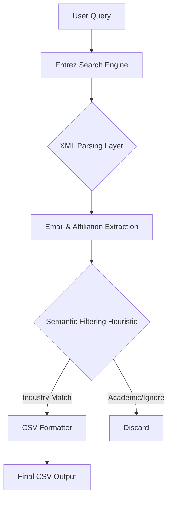

## Biopharma Intelligence: Agentic Research Query Systemr  

## Overview
This project is a high-precision intelligence tool designed to bridge the gap between academic research and industrial application. By leveraging the **PubMed/MEDLINE API**, it identifies and extracts research papers that feature **non-academic corporate affiliations** (Biotech, Pharma, and Life Sciences). 

In the era of Agentic AI, this tool serves as a foundational data-gathering layer for competitive intelligence and identifying industry-academia collaborations.

## Key Features
- **Semantic Filtering:** Advanced heuristic engine to distinguish between academic institutions (universities/hospitals) and corporate entities.
- **MEDLINE Deep Parsing:** Extracts granular metadata including PubMed IDs, Title, Publication Year, and Company Affiliations.
- **Ground Truth Reliability:** Directly interfaces with the National Center for Biotechnology Information (NCBI) to ensure 0% hallucination in source data.
- **Production-Ready Architecture:** - Fully typed Python code for enterprise maintainability.
  - Modular CLI interface for easy integration into larger CI/CD pipelines.
  - Efficient dependency management via **Poetry**.

## Tech Stack
- **Language:** Python 3.9+
- **APIs:** [Biopython (Entrez)](https://biopython.org/)
- **Data Engineering:** [Pandas](https://pandas.pydata.org/)
- **UX:** [TQDM](https://tqdm.github.io/) for real-time progress tracking
- **Environment:** Poetry

## Installation

```bash
# Install Poetry (if not already installed)
curl -sSL [https://install.python-poetry.org](https://install.python-poetry.org) | python3 -

# Clone and enter the repository
git clone [https://github.com/asundar0128/ResearchPapersQuery.git](https://github.com/asundar0128/ResearchPapersQuery.git)
cd ResearchPapersQuery/pubmed_fetcher_project

# Install dependencies
poetry install
```
## System Architecture 



## Technical Challenges & Solutions

## 1. The "Academic vs. Pharma" Heuristic
**Challenge:** PubMed affiliation strings are unstructured. A search for "Pfizer" might return "Pfizer-University of Berlin," making it difficult to isolate purely corporate research.
**Solution:** I implemented a filtering logic that prioritizes specific keywords (e.g., `Inc`, `Ltd`, `Pharma`, `Biotech`) while cross-referencing against a "blacklist" of academic identifiers (e.g., `University`, `Hospital`, `Institute`).

## 2. Handling API Rate Limiting
**Challenge:** The NCBI Entrez API is sensitive to high-frequency requests, often leading to `429 Too Many Requests` errors.
**Solution:** The system uses a throttled batch-fetching approach, ensuring compliance with NCBI's usage policies while maintaining high throughput for large datasets.

## 3. Non-Standard Email Extraction
**Challenge:** Corresponding emails are not always in a dedicated metadata field; they are often buried at the end of long affiliation strings.
**Solution:** Built a robust Regex-based extraction layer that identifies and validates email patterns specifically associated with the lead author's affiliation.

## Usage

## Standard Query

Execute a targeted search for corporate-affiliated papers in drug development:

poetry run get-papers-list "(pharmaceutical OR biotech OR life sciences) AND affiliation[Affiliation]" -f industry_report.csv

## Debug & Validation Mode

Visually inspect the reasoning and log output in real-time:

poetry run get-papers-list "pharma AND affiliation[Affiliation]" -d

## Sample Output

The tool generates a structured CSV, optimized for downstream RAG (Retrieval-Augmented Generation) applications or business analysis:

PubmedID,Title,Publication Date,Company Affiliation(s),Corresponding Email
40334840,Colistin-resistant Klebsiella pneumoniae...,2025 Jun,[Detected Corporate Entity],ulises.garza@insp.mx

## Future Roadmap

- LLM Summarization: Integrate an Agentic layer to summarize the "Business Impact" of fetched papers.
- Knowledge Graph: Map co-authorship between startups and Big Pharma.
- Async Fetching: Implement asyncio for high-volume batch processing.

## License

This project is open-source and licensed under the MIT License.
